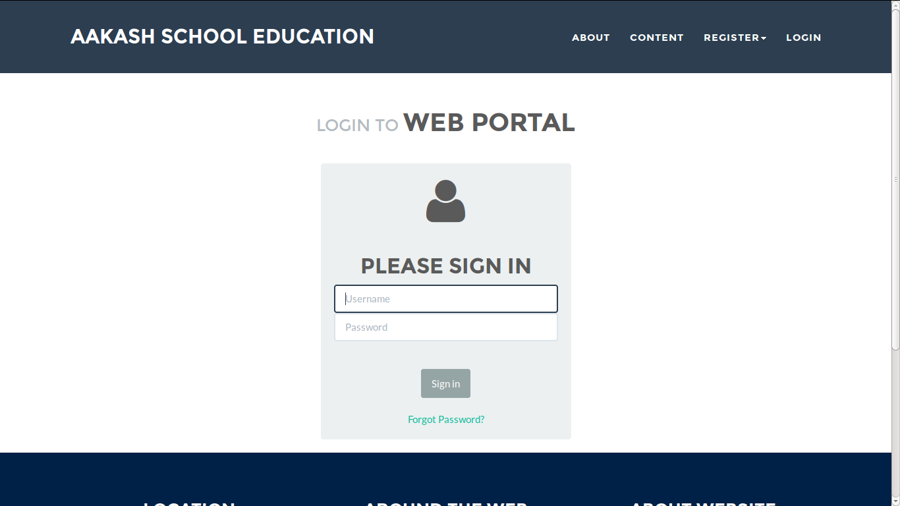

User's guide
============

Introduction
------------

- Aakash School Education is committed to offering the students free access to its many academic resources. We seek to capitalize on the   potential of the internet to eliminate borders and geographic distance as obstacles to the instantaneous exchange of knowledge and new ideas. Unlike distance learning programs that charge tuition, provide formal instruction and limit participation, we offer all course materials free to everyone with online access. People from around the world may upload their content and students can make use of our extensive library of content, including interactive challenges, assessments, and videos from any computer with access to the web. ASE does not require any registration and is not a degree-granting or certificate-granting activity rather it is instead an effort to share knowledge and make sure the students have access to world class education content making full use of the Internet's potential.

- The main purpose of creating web Application is to initialize task,it is an important part of the process. It requires putting together the Web Application project goals and purpose.

- Defining Web Application, Purpose, Goals and Direction establishes your project's clear direction and helps you focus on setting and achieving your goal.
 
**Why Python-Django**

    
- Python is an easy to learn, powerful programming language. It has efficient high-level data structures and a simple but effective
  approach to object-oriented programming.

- Django is a high-level Python Web framework that encourages rapid development and clean, pragmatic design.
  
- Django is a free and open source web application framework, written in Python, which follows the model–view–controller 
  architectural pattern.
  
- It lets you build high-performing, elegant Web applications quickly.
  
- Django was designed to handle two challenges: the intensive deadlines of a newsroom and the stringent requirements of the experienced
  Web developers who wrote it.

- Django's primary goal is to ease the creation of complex, database-driven websites. Django emphasizes reusability and "pluggability" 
  of components, rapid development.

  Advantage of using python over other programming languages

- Python programs run slower than the Java codes, but python saves much time ans space. Python programs are 3-5 times smaller than 
  java prog's.

- The elegant design and syntax rules of this programming language make it quite readable even among the multi programmer 
  development teams.

**GIT**
 
- GIT stands for Graphical Interactive Tool.

- GitHub is now the largest online storage space of collaborative works that exists in the world. 

- Git is version control software, which means it manages changes to a project without overwriting any part of that project.

- If you and a coworker are both updating pages on the same website. You make your changes, save them, and upload them back to the 
  website. So far, so good. The problem comes when your coworker is working on the same page as you at the same time. One of you is 
  about to have your work overwritten and erased.
  A version control application like Git keeps that from happening.

- You and your coworker can each upload your revisions to the same page, and Git will save two copies. Later, you can merge your 
  changes together without losing any work along the way.

**GNU/Linux**

- GNU is a Unix-like computer operating system developed by the GNU Project. It is composed wholly of free software. It is based on the 
  GNU  Hurd kernel and is intended to be a "complete Unix-compatible software system".

- The system's basic components include the GNU Compiler Collection (GCC), the GNU C library (glibc), and GNU Core Utilities 
  (coreutils), but also the GNU Debugger (GDB), GNU Binary Utilities (binutils),the bash shell and the GNOME desktop environment. 

- The GNU Project has endorsed variants using the Linux kernel, such as gNewSense, Trisquel and Parabola GNU/Linux-libre.

- LINUX is also a Unix-like and mostly POSIX-compliant computer operating system assembled under the model of free and open source 
  software development and distribution.

- The underlying source code may be used, modified, and distributed—commercially or non-commercially—by anyone under licenses such as 
  the GNU General Public License.

- Typically, Linux is packaged in a format known as a Linux distribution for desktop and server use. Some popular mainstream 
  Linux distributions include Debian, Ubuntu, Linux Mint, Fedora, Arch Linux, and the commercial Red Hat Enterprise Linux and SUSE
  Linux Enterprise Server. 

- Linux distributions include the Linux kernel, supporting utilities and libraries and usually a large amount of application software 
  to fulfill the distribution's intended use.

- The open-source software movement arose to clarify the environment that the new copyright, licensing, domain, and consumer issues created.

- Open-source code is typically a collaborative effort where programmers improve upon the source code and share the changes within 
  the community so that other members can help improve it further.

- Distros designed to replace your existing operating system some othere linux distros are Ubuntu,OpenSUSE,Fedora etc.

- Ubuntu is a Debian-based Linux operating system, with Unity as its default desktop environment (GNOME was the previous 
  desktop environment).Ubuntu is the most popular desktop Linux distribution.

- The Ubuntu project is publicly committed to the principles of open source development; people are encouraged to use free software, 
  study how it works, improve upon it, and distribute it.

 
Description
-----------

Workflow
~~~~~~~~

- A model is the single, definitive source of information about your data. It contains the essential fields and behaviors of the data you’re storing. Generally, each model maps to a single database table.Each attribute of the model represents a database field.

 *In this website there are various fields they are:*

- Class: describes which class the student belongs to. Based on the class, the student accesses the study materials.The study materials are viewed by the teacher and a remark is given. Administrator stores number of classes in the database so that user can contribute or review on a particular class.

- Comment: The comments are given by the reviewer based on the topic of the subject. The date on which the comments are submitted are also noted along with the reviewer name.

- Topic: The user should mention the particular topic of the selected subject. The topic is stored in the database.
   - Every user who logs in must be either a user or contributor or reviewer.
   - If the person who logs in, is a user he can just see the materials but cannot modify the data. He can see the comments given by the reviewers but can not comment.
   - If the person who logs in, is a contributor he will be given permission to upload different formats of the files. The contributor can see the comments given by the reviewers.
   - If the person who logs in, is a reviewer he will be given permission to review the uploaded files of the contributor and comment on the uploaded files.
   - Reviewer is the specialized person in the subject and as a reviewer he doesn't have the right to upload any files.
   - An upload will be available to the user if and only if it is approved by atleast 3 reviewers.
   - The user searches the study materials based on the class number,subject and topic.
   - The user may download either pdf,video or animation materials.

- Contact: Non-user can give the suggestions based on the different uploads done by the contributor. He/she can send their name,email id and message in order to modify changes in uploads. What ever the message sent by the non-user will be seen by administrator and if administrator accepts it then further modifications are done on the uploads.

- Contributor: A contributor can sign up by filling their name, contact, picture and validation-docs in the registration form. Now the administrator will check the details of contributor and if the access permissions are granted then they can upload any file formats. Here the access permissions are given to contibutor by admin based on the capabilites of validation-docs.

- Reviewer: A reviewer can sign up by filling their name, contact and picture in the registration form. Now the administrator will check the details of reviewer and if the access permissions are granted then they can comment on the uploaded files.

- Faq: Faq consists of fields like questions and answers. It describes the frequently asked questions and answers by users.

- Language: Users can download or view the files in three different languages.

- Subject: A contributor can upload the file that should have name, topic, class-name and that file can be in pdf, video, animation formats. Rating can be given by administrator based on the capabilities of contributor upload.

Interface
~~~~~~~~~

Explain each page in detail with screen-shots.

Example:

   Login page

Conclusion
----------

- Students are given the opportunity to choose from various subjects and topics so that they can gain more knowledge. This is especially beneficial for those who live in rural areas that only have one or two educational facilities, which most of the time, offer limited course and program options for students. 

- Another benefit of taking online tutorials, and probably the most popular one, would be that it offers flexibility to students. Because they can attend classes and courses whenever and wherever there is a computer and access to the internet, they can easily plan out a schedule that would work for them. 

- Online learning allows a more student-centered teaching approach. Because every student has his or her way of learning that works for them, getting an online education may help in ensuring that each lesson or material is completely understood before moving on to the next, which in turn, could result to better learning.

- Online course materials can be accessed 24 hours a day every day. This means that students can easily read and review lectures, discussions and other materials relevant to their subjects. There are some students who find it a bit difficult to understand spoken material in a typical classroom setting because of a number of distractions, boredom or tiredness. Because they can simply access the material online once they are prepared to learn, students are able to take in and understand the material a lot better. 

- Because of the flexibility offered by online learning, not only undergraduate students, but also individuals who already have full-time jobs or other commitments are able to take supplementary courses and even earn their college degrees online. 

Reference
---------

- `<https://www.djangoproject.com/>`_

- `<http://www.tangowithdjango.com/>`_

- `<http://www.startbootstrap.com/>`_

- `<http://www.stackoverflow.com/>`_

- `<http://www.aakashlabs.org/>`_

- `<http://sphinx-doc.org>`_
